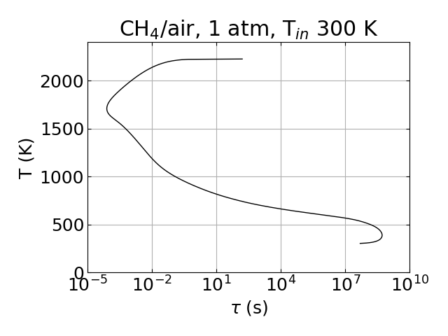

# PSR solver
* Adiabatic, steady state
* Uses Cantera for thermochemical properties
    * Note, Cantera was built with Sundials installed separately
* Uses Sundials Kinsol for solving the system of equations
* Solves for the full range of residence times.
* Solution is saved to file ```tau_T.dat```. File ```plot.py``` is called, which creates ```tau_T.png```.

Solve the following equations:
$$\frac{y_k^{in} - y_k}{\tau} + \dot{m}_k^{\prime\prime\prime} = 0,$$
$$h = h^{in}.$$

For a given $\tau$, the PSR has multiple solutions: burning, extinguished, and an intermediate branch. The $T(\tau)$ profile is in the shape of an "S". In order to solve the full S-curve without considering multiple solutions, the temperature is specified between the inlet and equilibrium values and $\tau$ is solved as one of the unknowns. The solution begins near adiabatic equilibrium and then progresses to lower $T$, using previous solutions as the guess for the next point.


